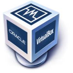
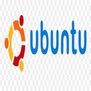

# Deliverable 1

## Basic Terminology

### What is a web server? Hardware and software side
A web server is a computer that stores, processes, and delivers website files to web browsers.Web servers consist of hardware and software that use Hypertext Transfer Protocol (HTTP) to respond to web users’ requests made via the World Wide Web.Web servers also use Simple Mail Transfer Protocol (SMTP) and File Transfer Protocol (FTP) to process files for email or storage.

On the hardware side, a web server connects to the internet, which enables it to exchange data or files between other devices that are likewise connected. HOwever, a Web server software controls how web users access hosted files. It consists of several components, housing at least an HTTP server. An HTTP server is software that can understand HTTP requests and URLs.

### What are some different web server applications?

| Application Name | license                     | Project's Website                 |
| ---------------- | --------------------------- | --------------------------------- |
| APACHE           | Apache License, Version 2.0 | [APACHE](https://www.apache.org)  |
| NGINX            | 2-clause BSD license        | [NGINX](https://www.nginx.com/)   |
| Caddy            | Apache 2                    | [Caddy](https://caddyserver.com/) |

#### Web server APACHE

Apache is the second most popular web server software, used by 31.5 percent of all known websites. It’s an open-source project that uses HTTP protocol and operates across various OSs, including Windows and Linux.The Apache HTTP Server Project is an effort to develop and maintain an open-source HTTP server for modern operating systems including UNIX and Windows. The goal of this project is to provide a secure, efficient and extensible server that provides HTTP services in sync with the current HTTP standards.
The Apache HTTP Server Project is a collaborative software development effort aimed at creating a robust, commercial-grade, featureful, and freely-available source code implementation of an HTTP (Web) server.

#### Web server NGINX

GINX is perhaps the most famous for its high-performance features. Since the web server software is designed to handle multiple connections simultaneously, it’s ideal for high-traffic sites and demanding environments. With NGINX, you’ll get enhanced loading times with minimal drain on your server resources.

#### Web server Caddy

 Caddy is a user-friendly and secure web server. This software uses HTTPS connections by default. Therefore, it can be an excellent choice to encrypt your website’s data and protect it against malicious interceptions.

### What is virtualization?
Virtualization is the process of running a virtual instance of a computer system in a layer abstracted from the actual hardware. Most commonly, it refers to running multiple operating systems on a computer system simultaneously. There are many reasons why people utilize virtualization in computing. To desktop users, the most common use is to be able to run applications meant for a different operating system without having to switch computers or reboot into a different system. F

### What is virtualbox?

Oracle VM VirtualBox (formerly Sun VirtualBox, Sun xVM VirtualBox and InnoTek VirtualBox) is a type-2 hypervisor for x86 virtualization developed by Oracle Corporation. VirtualBox was originally created by InnoTek Systemberatung GmbH, which was acquired by Sun Microsystems in 2008, which was in turn acquired by Oracle in 2010. It allows users to extend their existing computer to run multiple operating systems including Microsoft Windows, Mac OS X, Linux, and Oracle Solaris, at the same time.

### What is a virtual machine?
A virtual machine (VM) is a digital version of a physical computer. Virtual machine software can run programs and operating systems, store data, connect to networks, and do other computing functions, and requires maintenance such as updates and system monitoring. A system virtual machine is fully virtualized; it provides a platform for the execution of a complete operating system. Here, multiple VMs can run in parallel on a host system, sharing the physical resources. Some examples are VMWare, VirtualBox, and Parallels.

### What is Ubuntu Server?

Ubuntu Server is a part of the larger set of Ubuntu products and operating system developed by Canonical Ltd. Ubuntu server is a specific addition that differs a little bit from Ubuntu desktop, in order to facilitate installation on servers. Ubuntu Server is an open source platform that does more than you might think. With its ability to serve as an internal company server or to scale all the way up and out to meet enterprise-level needs, this operating system can do it all.

### What is a firewall?

A firewall is a network security device that monitors incoming and outgoing network traffic and permits or blocks data packets based on a set of security rules. Its purpose is to establish a barrier between your internal network and incoming traffic from external sources (such as the internet) in order to block malicious traffic like viruses and hackers. Firewalls carefully analyze incoming traffic based on pre-established rules and filter traffic coming from unsecured or suspicious sources to prevent attacks. 

### What is SSH?
The SSH protocol (also referred to as Secure Shell) is a method for secure remote login from one computer to another. It provides several alternative options for strong authentication, and it protects communications security and integrity with strong encryption. It is a secure alternative to the non-protected login protocols (such as telnet, rlogin) and insecure file transfer methods (such as FTP).SSH is a cryptographic network protocol for operating network services securely over an unsecured network. Its most notable applications are remote login and command-line execution. 