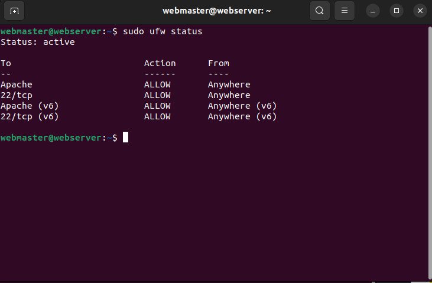
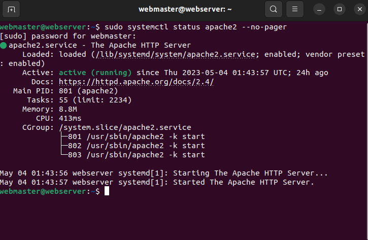
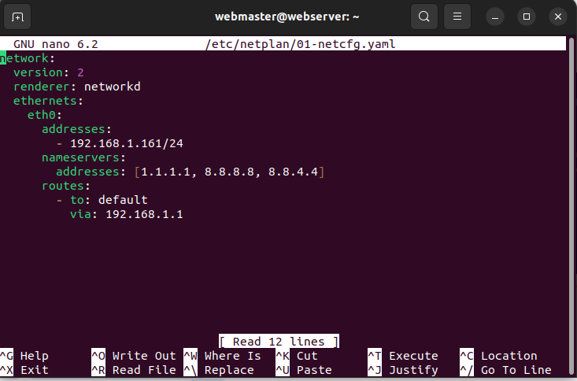
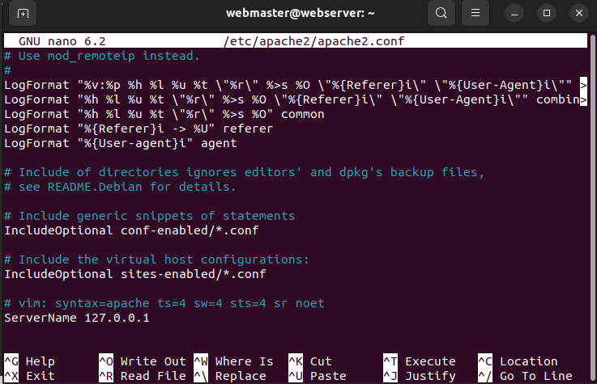
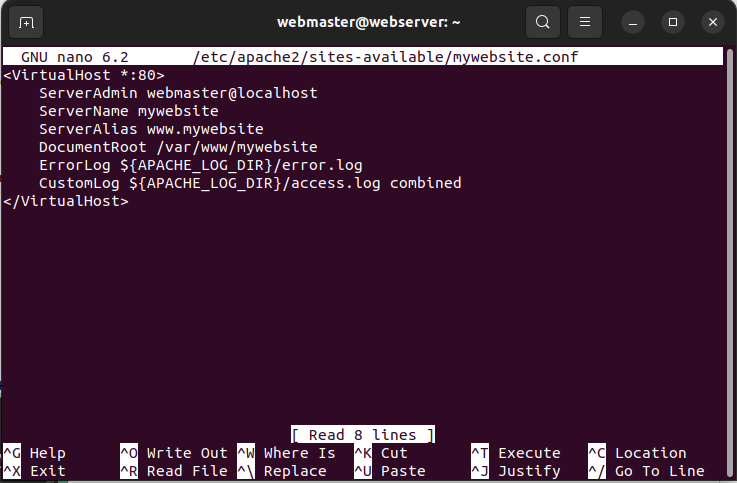
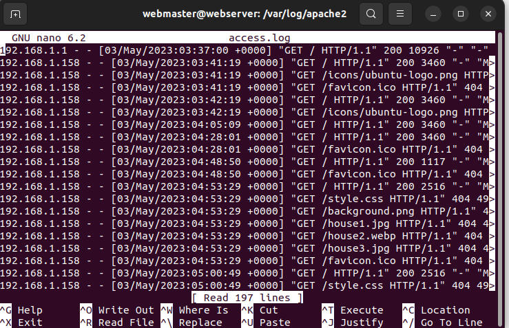
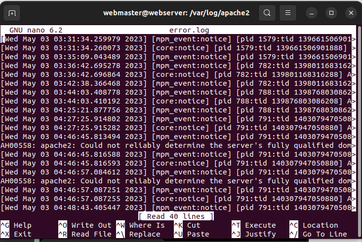
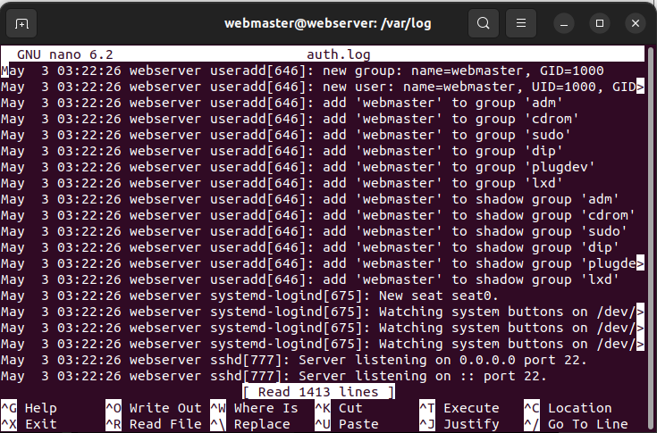
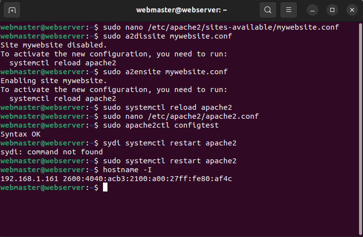

# Final Project Ubuntu Server Installed 

## Ubuntu Server Installed in Virtual Box

## Ubuntu Server Successfully installed

## Firewall status

## Apache status

## Ssh status

## Default page 

## My netplan 

## Apache conf file

## Site-Available conf file

## Apache access log file

## Apache error log file 

## SSH auth log file 

# Terminal 

## My website screenshot 

