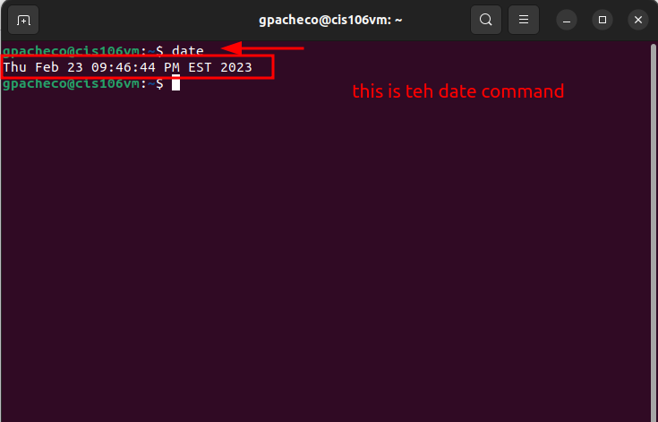
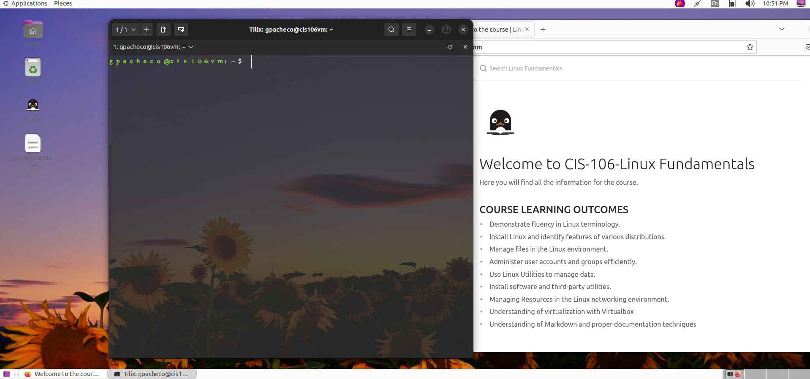

# Lab 3 submission 

## Question 1

## Question 2

## Question 3
| Program purpose     | Package Name | Version            |
| ------------------- | ------------ | ------------------ |
| Play a tetris game  | Blockattack  | 2.7.0-1            |
| Play a video file   | Dragonplayer | 4:21.12.3-0ubuntu1 |
| Browse the internet | Dillo        | 3.0.5-7build1      |
| Read your email     | Geary        | 40.0-2             |
| Play music          | Sonata       | 1.7.0-1            |

## Question 4
| command | what it does                                                                                                    |
| ------- | --------------------------------------------------------------------------------------------------------------- |
| echo    | This command print text in the command line                                                                     |
| fortune | This command print random text in the command line                                                              |
| cowsay  | This command print a graphic cow with text                                                                      |
| lolcat  | This command print text in different colors                                                                     |
| figlet  | This command display text in bigger sizes.                                                                      |
| toilet  | This command modified text in different ways, and it can also changes the direction of the text and add colors. |
| rig     | This command displays people's information , such as, names, address and phone number.                          |
