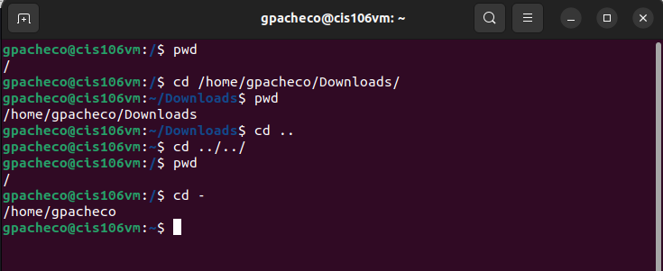
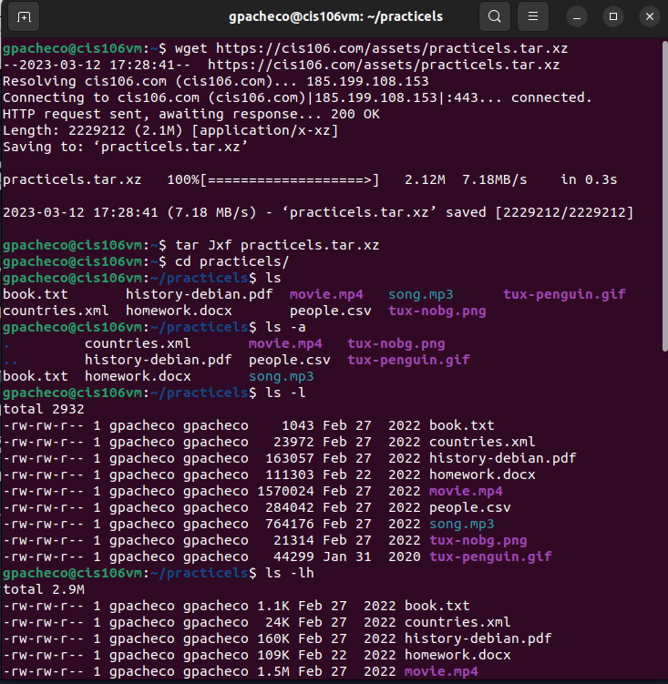
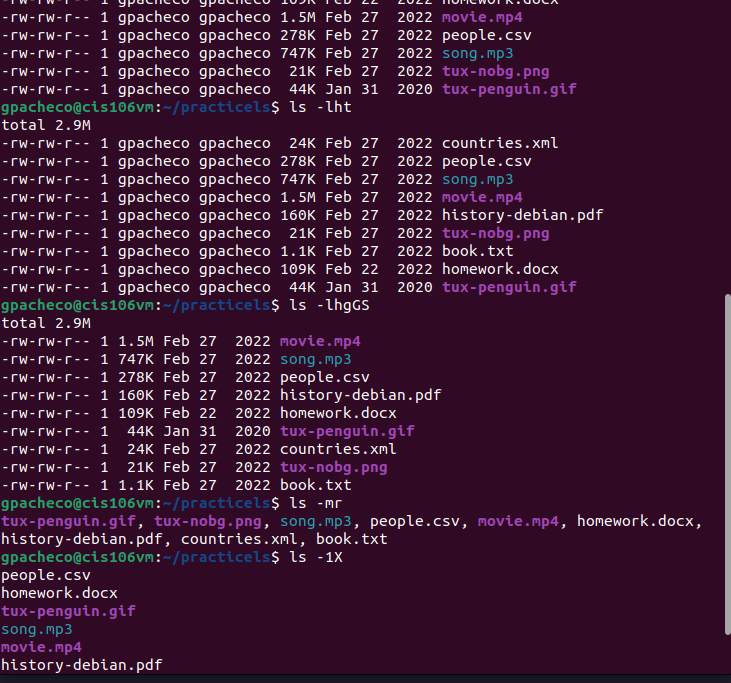
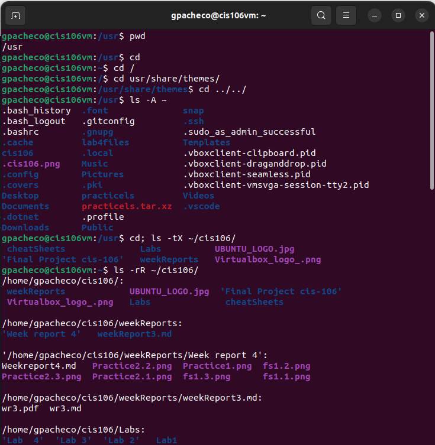
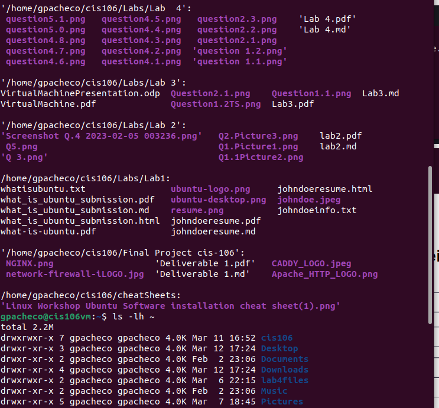
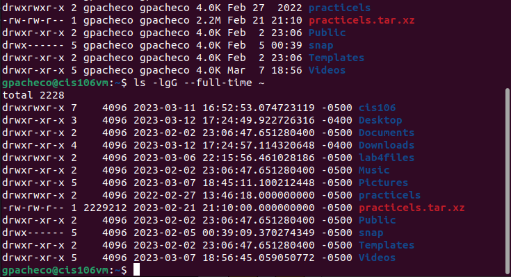
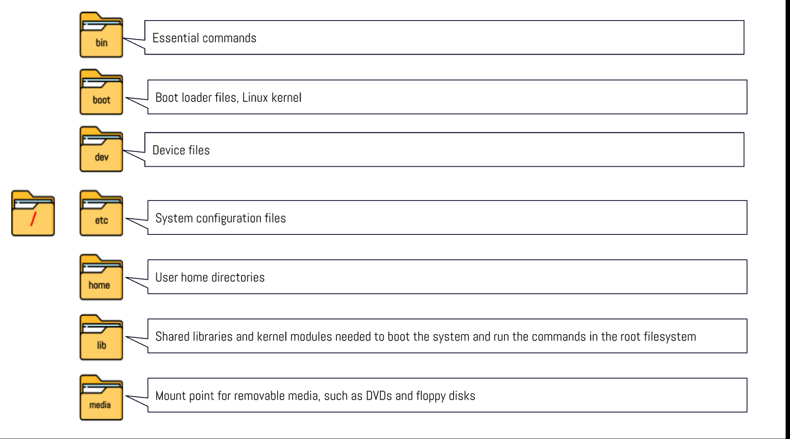
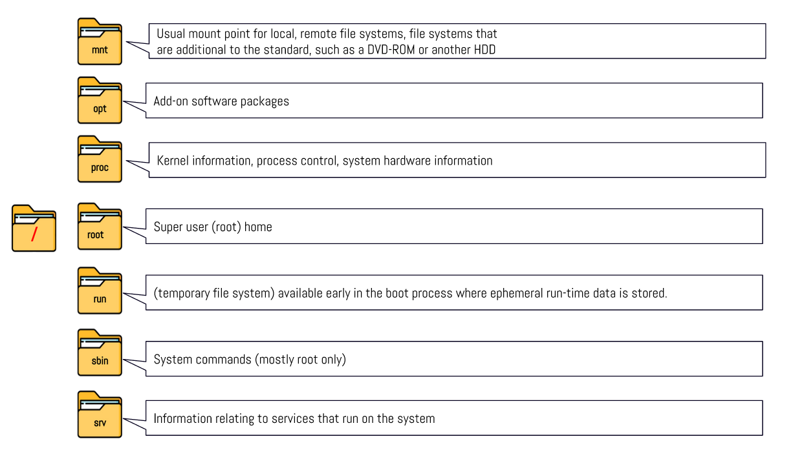
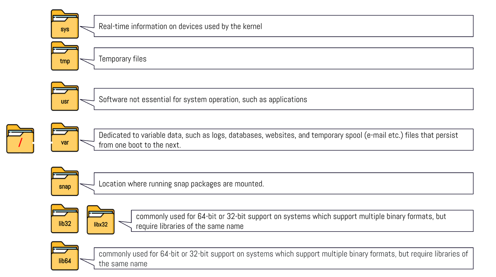

---

Name: Greidy Pacheco
Course: CIS 106
Semester: Spring 2023
Instructor: Roberto Alberto
---

# Week Report 4

## Practice
### Practice 1

### Practice 2

### Practice 3

## The Linux fille directory and their purpose

## All Commands for navigating the file system
| Command | What it does                                                                           | Syntax                            | Example           |
| ------- | -------------------------------------------------------------------------------------- | --------------------------------- | ----------------- |
| pwd     | Prints the current working directory                                                   | `pwd`                             | `pwd`             |
| cd      | It changes the currents working directory                                              | `cd +  destination`               | `cd /Downloads`   |
| ls      | Its function is to list the content of a given directory or the file/directory itself. | `ls + option + directory to list` | `ls -l /Pictures` |

## Basic Terminology

* **File system**
In a computer, a file system -- sometimes written filesystem -- is the way in which files are named and where they are placed logically for storage and retrieval. Without a file system, stored information wouldn't be isolated into individual files and would be difficult to identify and retrieve.
  
* **Current directory**
  Alternatively called working directory or current working directory (CWD), the current directory is the directory or folder where you are currently working. The following sections contain some common use examples involving the current working directory.
  
  
* **Parent directory**
  A parent directory is a directory containing the current directory. For example, in the MS-DOS path below, the "Windows" directory is the parent directory of the "System32" directory, and C:\ is the root directory.

* **The different between your home directory and the home directory**
  My home directory means a storage folder that contains the user's personal files, also can be the default working directory when a user logs in. While the home directory is the root directory file.

* **Pathname**
  The set of names required to specify a particular file in a hierarchy of directories is called the path to the file, which you specify as a path name. Path names are used as arguments for commands.
  
* **Relative path**
  A relative path is used to locate a directory from the current working directory.
  
  
* **Absolute path**
  An absolute path is a sequence that begins with a slash for the root, followed by one or more directory names separated with slashes, and ends with a directory name or a file name. The search for the file begins at the root and continues through the elements in the path name until it gets to the final name.
