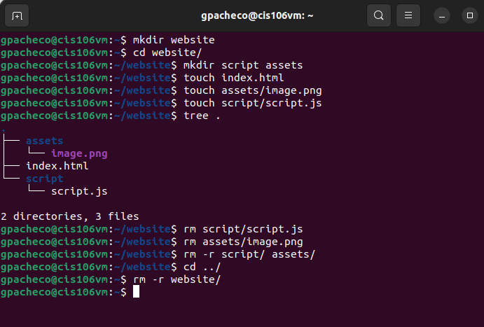
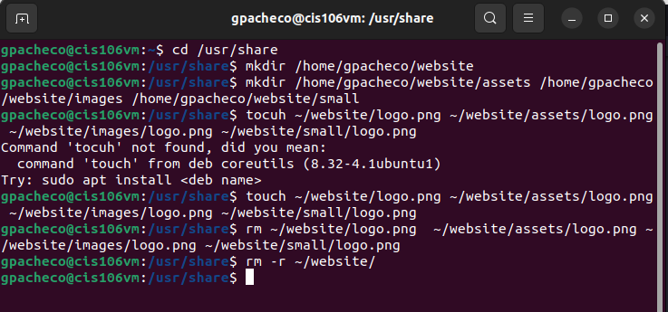
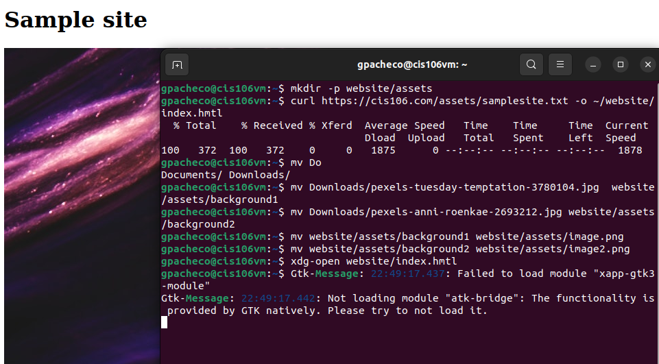
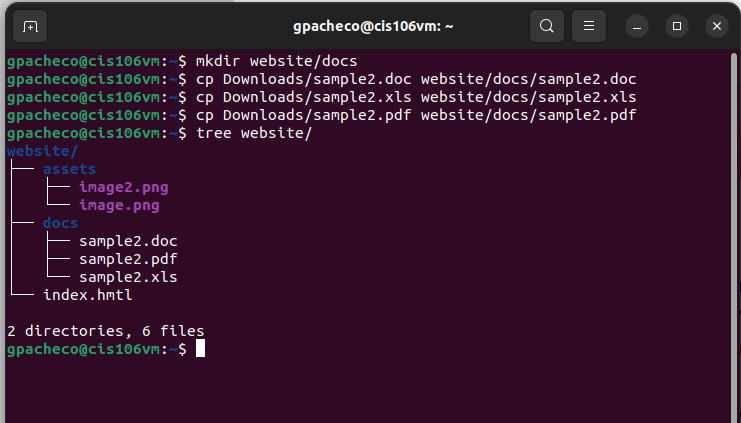

# Week Report 5

## Answer to questions: 

* **What are Command Options?**
  
  Command-line options are commands used to pass parameters to a program. These entries, also called command-line switches, can pass along cues for changing various settings or executing commands in an interface.

*  **What are Command Arguments?**
An argument, also called command line argument, can be defined as input given to a command line to process that input with the help of given command. Argument can be in the form of a file or directory.

Arguments are entered in the terminal or console after entering command. They can be set as a path. We can also write more than one argument together, they will be processed in the order they are writtten.

* **Which command is used for creating directories? Provide at least 3 examples.**
The command used is `mkdir`. See below examples:

Example #1 
`mkdir Background`

Example #2 
`mkdir ~/Download/background`

Example #3
`mkdir -p ~/background/photos ~/background/abstract`

* **What does the touch command do? Provide at least 3 examples.**
* The `touch` command is used for creating files. See below examples:

Example #1
`touch datalist`

Example #2
`touch greys.png list1.txt WorkBook.pdf`

Example #3
`touch ~/datalist/list1.txt`

* **How do you remove a file? Provide an example.**
  To remove a file it is used `rm` command. For example, `rm datalist`.

* **How do you remove a directory and can you remove non-empty directories in Linux? Provide an example**
  To remove a directory it is used `rmdir` command. Also, a non-empty directory in Linux can be removed using `rm -r` command. Example, `rm -r Photos/abstractic

* **Explain the mv and cp command. Provide at least 2 examples of each**
  
  The `mv` commands is used for move and rename directories. Example, `mv photos/abstractic Download`.

  The `cp` command is used for copy. For example `cp photos/luz.png Download.luz2.png` 

# **Practice 1**

# **Practice 2**

# **Practice 3**

# **Practice 4**
