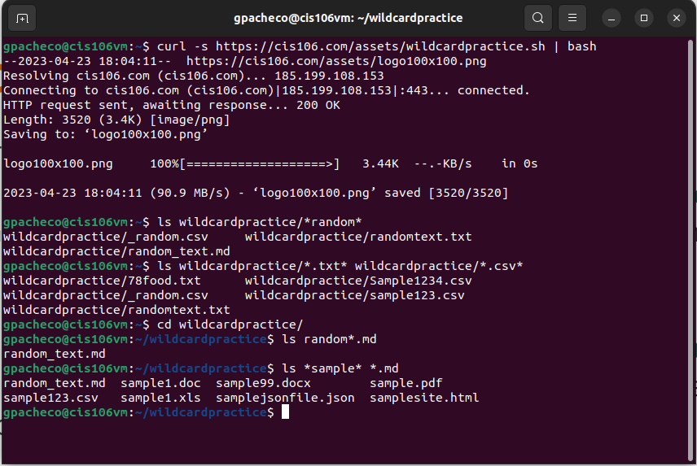
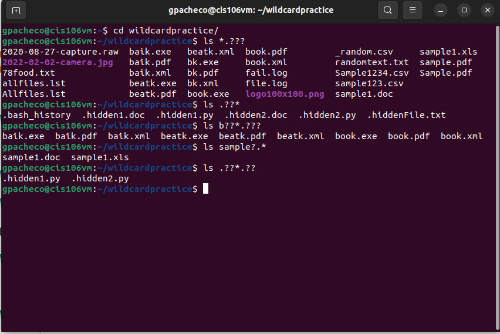

# Week Report 6

## Wildcards 

### * Wildcard 

The * wildcard will match any character and number. 
Example:
* To list any text file starting with letter p no matter the extension.
  * `ls p*.txt`
* To list any text file named ubuntu
  * `ls ubuntu.*`
* To move any file with a PDF extension.
  * `mv Downloads/*.pdf ~/Documents/`

### ? Wildcard

The ? wildcard will precisely match one character, very useful when working with hidden files.
Example: 
* To list all the files with 2 character extension.
  * `ls *.??`
* To  list any file containing 2 characters after the name ubuntu and containing 3 characters as extension.
  * `ls ubuntu??.???`
* To copy all file mp3 and mp4 character extension.
  * `cp ~Downloads/*.mp? ~/Videos/Movies`

### [] Wildcard

The [] wildcard will match a single character in a range including numbers and letter.
Example: 
* To list all the file including a number after the name. 
  * `ls file[0-9].*`
* To list all the text file with a vowel after the letter f.
  * `ls f[aeiou]*.txt`
* To list all the PDF files with two number in the beginning.
  * `ls [0-9][0-9]file.pdf`

## Brace Expansion

The brace expansion is not a wildcard. Is use to generate arbitrary strings to use with commands to create and remove multiple files and directories at one time.
Example:
* To create multiple directories 
  * `mkdir -p website/files/{docs,pdf,txt}`
* To remove multiple files
  * `rm -r website/file/{pdf,txt}`
* To create multiple directories with an x number of files
  * `touch website/logfile{1..10}.txt`

## Practice * wildcard 

## Practice ? wildcard

## Practice [] wildcard

![[]wildcardpractice](%5B%5Dwildcardpractice.png)